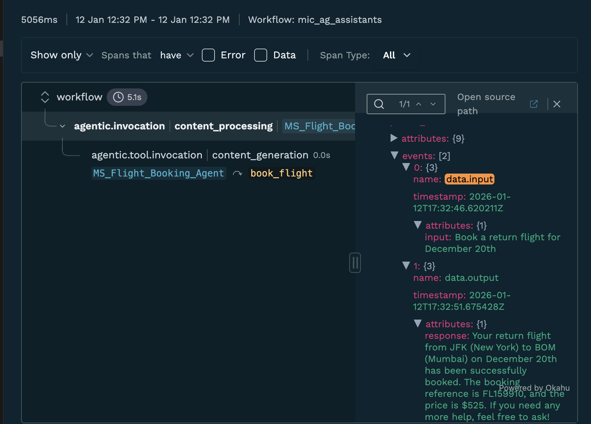

# Okahu agent demo with Microsoft Agent Framework (Azure OpenAI)

This repo includes a demo agent application built using Microsoft Agent Framework and pre-instrumented for observation with Okahu AI Observability Cloud. You can fork this repo and run it in GitHub Codespaces or locally to get started quickly.

## Prerequisites

- Azure OpenAI credentials (API key or Azure CLI access)
- Install the Okahu Extension for VS Code


- An Okahu tenant and API key for the Okahu AI Observability Cloud
  - Sign up for an Okahu AI account with your LinkedIn or GitHub ID
  - After login, navigate to 'Settings' (left nav) and click 'Generate Okahu API Key'
  - Copy and store the key safely. You cannot retrieve it again once you leave the page

## Get started

### Create python virtual environment
```bash
python -m venv .venv
```

### Activate virtual environment

**Mac/Linux**
```bash
source .venv/bin/activate
```

**Windows**
```bash
.venv\Scripts\activate
```

### Install python dependencies
```bash
pip install -r requirements.txt
```

### Configure the demo environment

**Option 1: Using Azure OpenAI API Key**
```bash
export AZURE_OPENAI_API_KEY=<your-azure-openai-api-key>
export AZURE_OPENAI_ENDPOINT=<your-azure-openai-endpoint>
export AZURE_OPENAI_MODEL_DEPLOYMENT_NAME=<your-deployment-name>
export AZURE_OPENAI_API_VERSION=2024-05-01-preview
```

**Option 2: Using Azure CLI Authentication**
```bash
# Install Azure CLI (if not already installed)
brew install azure-cli  # Mac
# or download from: https://docs.microsoft.com/en-us/cli/azure/install-azure-cli

# Login to Azure
az login

# Set environment variables
export AZURE_OPENAI_ENDPOINT=<your-azure-openai-endpoint>
export AZURE_OPENAI_MODEL_DEPLOYMENT_NAME=<your-deployment-name>
export AZURE_OPENAI_API_VERSION=2024-05-01-preview
```

- Replace `<your-azure-openai-api-key>` with your Azure OpenAI API key (if using Option 1)
- Replace `<your-azure-openai-endpoint>` with your Azure OpenAI endpoint (e.g., `https://your-resource.openai.azure.com/`)
- Replace `<your-deployment-name>` with your model deployment name (e.g., `gpt-4`)
- **Note**: Assistants API requires endpoints in supported regions (East US, Sweden Central, Australia East)

### Run the pre-instrumented travel agent app
```bash
python mic_travel_agent.py
```

This application is a travel agent that demonstrates Azure-managed session persistence with the Microsoft Agent Framework.
- It is a Python program using **Microsoft Agent Framework**.
- The app uses **AzureOpenAIAssistantsClient** with Azure OpenAI Assistants API.
- **Server-managed sessions**: Azure automatically stores conversation threads on the server with persistent `service_thread_id`.
- **Long-term memory**: Session state is maintained by Azure - no local storage required.

### Session Management with Microsoft Agent Framework (Azure Assistants API)

**How Azure Assistants API provides memory:**
- **AzureOpenAIAssistantsClient** connects to Azure's Assistants API with server-managed threads
- Azure automatically creates and stores threads with IDs like `thread_abc123`
- `thread.service_thread_id` provides the Azure-managed thread ID
- Sessions are persisted on Azure's server - no local storage needed
- Resume conversations by passing `service_thread_id` to `get_new_thread()`

**Key Features:**
- Server-managed conversation threads (stored by Azure)
- Automatic persistence - no manual serialization required
- Resume sessions using Azure-generated thread IDs
- Long-term memory maintained by Azure
- Multi-turn conversations with full context

**Session Flow:**
1. Create a new thread → Azure generates `thread_abc123`
2. User interactions → messages stored on Azure server
3. Get thread ID → `thread.service_thread_id`
4. Store thread ID for later (just the ID string, not the full conversation)
5. Resume → `get_new_thread(service_thread_id=thread_id)`
6. Azure retrieves full conversation history automatically
7. Continue conversation with complete context

**Authentication:**
- **Option 1**: Azure OpenAI API Key (set `AZURE_OPENAI_API_KEY`)
- **Option 2**: Azure CLI (run `az login` - no API key needed)

**Requirements:**
- Azure OpenAI endpoint with Assistants API enabled
- Supported regions: East US, Sweden Central, Australia East
- API version: `2024-05-01-preview` or newer

The application demonstrates:
- Creating new Azure-managed threads
- Maintaining conversation context across multiple turns
- Automatic session persistence on Azure server
- Resuming previous sessions using thread IDs

Example interaction:
```
🆕 Creating new Azure-managed thread...

[User]: Book a flight from BOM to JFK for December 15th
[Agent]: Your flight from BOM to JFK for December 15th has been successfully booked...

📋 Azure Thread ID: thread_KK53tMKAQSWTy5mTJyxyZQCa
✅ Thread is stored on Azure server - use this ID to resume

[User]: Book a return flight for December 20th
[Agent]: Your return flight from JFK to BOM for December 20th has been successfully booked...

============================================================
🔄 Simulating session resume (like after app restart)
============================================================
✅ Thread resumed with ID: thread_KK53tMKAQSWTy5mTJyxyZQCa
🔗 Azure retrieved full conversation history from server

[User]: What did we talk about?
[Agent]: We discussed booking flights for you. Specifically:
- You requested a flight from BOM to JFK for December 15th...
- Then, you asked for a return flight from JFK to BOM for December 20th...
```

## Test scenarios

### a. Basic flight booking:
```
Book a flight from BOM to JFK for December 15th
```

### b. Multi-turn conversation with context:
```
First: Book a flight from BOM to JFK for December 15th
Then: Book a return flight for December 20th
Finally: What flights did we book?
```
Expected: Agent remembers both bookings and provides confirmation details.

### c. Session resume:
```
# Run the app, book some flights, note the thread ID, then restart
# Azure maintains the conversation - just use the thread ID to resume
What was the confirmation number for the first flight?
```
Expected: Agent recalls details from Azure-stored thread history.

### d. Airport code handling:
```
Book a flight from Mumbai to New York next week
```
Expected: Agent interprets city names and books appropriately.

### e. Date handling:
```
Book a flight from SFO to LAX tomorrow
Book a flight from LAX to SFO next Monday
```
Expected: Agent handles relative date references.

## View traces

### Option 1: View traces in VS Code

1. Open the Okahu AI Observability extension


2. Select a trace file
3. Review trace and prompts generated by the application



### Option 2: View traces in Okahu Portal

1. Login to Okahu portal
2. Select 'Component' tab
3. Type the workflow name `mic_ag_fm` in the search box
4. Click the workflow tile
5. Review traces and prompts generated by the application

## Architecture

The application uses:
- **Microsoft Agent Framework** for agent orchestration
- **AzureOpenAIAssistantsClient** for Azure OpenAI Assistants API integration
- **AgentThread** with server-managed sessions (Azure-stored threads)
- **Monocle tracing** for observability (configured with workflow name `mic_ag_assistants`)
- **Function tools** for flight booking capabilities
- **Azure CLI or API Key** authentication

## Multi-Agent Orchestration

The Microsoft Agent Framework supports multiple orchestration patterns for coordinating agent workflows:

| Orchestrator | Description | 
|--------------|-------------|
| **Sequential** | Agents execute tasks in a pipeline, one after another | 
| **Concurrent** | Multiple agents work on the same task in parallel | 
| **Handoff** | Agents transfer control based on context or expertise | 
| **GroupChat** | Collaborative conversation with manager coordination | 
| **Magnetic** | Dynamic collaboration for complex, open-ended tasks | 

Monocle currently supports Sequential and Handoff workflow 

**Monocle Observability Features:**
- Track agent interactions and execution order
- Visualize message flow between agents
- Monitor performance metrics and token usage per agent
- Maintain session context across multi-turn conversations

All traces are automatically captured with `setup_monocle_telemetry()` at the start of your application.


### Trace Files

Monocle traces are written to files for observability:
- Check for trace files in your working directory
- View traces in VS Code using the Okahu extension
- Upload to Okahu portal for team collaboration
