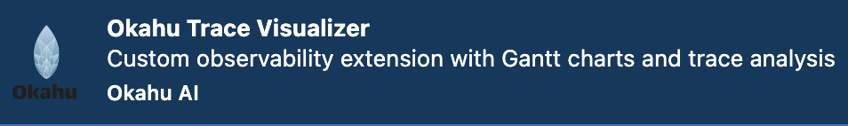
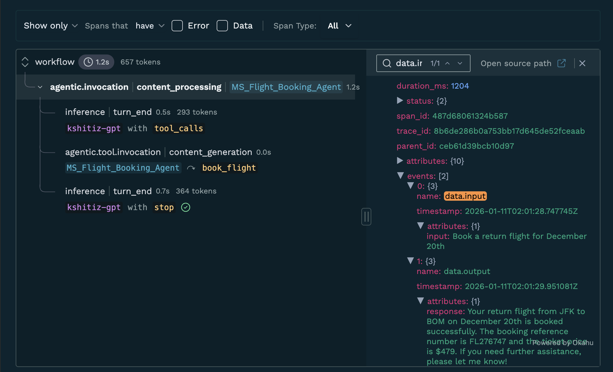

# Okahu agent demo with Microsoft Agent Framework (Azure OpenAI)

This repo includes a demo agent application built using Microsoft Agent Framework and pre-instrumented for observation with Okahu AI Observability Cloud. You can fork this repo and run it in GitHub Codespaces or locally to get started quickly.

## Prerequisites

- Azure OpenAI credentials (API key or Azure CLI access)
- Install the Okahu Extension for VS Code



- An Okahu tenant and API key for the Okahu AI Observability Cloud
  - Sign up for an Okahu AI account with your LinkedIn or GitHub ID
  - After login, navigate to 'Settings' (left nav) and click 'Generate Okahu API Key'
  - Copy and store the key safely. You cannot retrieve it again once you leave the page

## Get started

### Create python virtual environment
```bash
python -m venv .venv
```

### Activate virtual environment

**Mac/Linux**
```bash
source .venv/bin/activate
```

**Windows**
```bash
.venv\Scripts\activate
```

### Install python dependencies
```bash
pip install -r requirements.txt
```

### Configure the demo environment

**Option 1: Using Azure OpenAI API Key**
```bash
export AZURE_OPENAI_API_KEY=<your-azure-openai-api-key>
export AZURE_OPENAI_ENDPOINT=<your-azure-openai-endpoint>
export AZURE_OPENAI_API_DEPLOYMENT=<your-deployment-name>
```

**Option 2: Using Azure CLI Authentication**
```bash
# Install Azure CLI (if not already installed)
brew install azure-cli  # Mac
# or download from: https://docs.microsoft.com/en-us/cli/azure/install-azure-cli

# Login to Azure
az login

# Set environment variables
export AZURE_OPENAI_ENDPOINT=<your-azure-openai-endpoint>
export AZURE_OPENAI_API_DEPLOYMENT=<your-deployment-name>
```

- Replace `<your-azure-openai-api-key>` with your Azure OpenAI API key (if using Option 1)
- Replace `<your-azure-openai-endpoint>` with your Azure OpenAI endpoint (e.g., `https://your-resource.openai.azure.com/`)
- Replace `<your-deployment-name>` with your model deployment name (e.g., `gpt-4`)

### Run the pre-instrumented travel agent app
```bash
python mic_agent_new.py
```

This application is a travel agent that demonstrates session management and multi-turn conversations with the Microsoft Agent Framework.
- It is a Python program using **Microsoft Agent Framework**.
- The app uses Azure OpenAI models for inference.
- **Session management with AgentThread**: The agent maintains conversation history through serialization/deserialization, enabling persistent sessions across program restarts.

### Session Management with Microsoft Agent Framework

**How AgentThread provides memory:**
- **AgentThread** automatically stores all conversation messages in memory (`thread._messages`)
- `thread.serialize()` captures the full conversation state into a dictionary
- `agent.deserialize_thread()` restores the complete conversation history from serialized data
- Session persistence is handled through your own storage mechanism (file, database, Redis, etc.)

**Key Features:**
- Generate unique session IDs for tracking conversations
- Serialize thread state for persistent storage
- Deserialize to resume conversations with full context
- Agent remembers all previous interactions within a session

**Session Flow:**
1. Create a new thread → stores messages in memory
2. User interactions → messages accumulate in thread
3. Serialize → capture conversation state as dict
4. Store serialized data (your choice: DB, file, cache)
5. Later, deserialize → full conversation memory restored
6. Continue conversation with complete context

The application demonstrates:
- Creating new sessions with unique IDs
- Maintaining conversation context across multiple turns
- Serializing sessions for storage
- Deserializing and resuming previous sessions

Example interaction:
```
Session ID (your tracking): a1b2c3d4
Service Thread ID (Azure): None (None = local management)

[User]: Book a flight from BOM to JFK for December 15th
[Agent]: Your flight from BOM to JFK for December 15th has been successfully booked...

[User]: Book a return flight for December 20th
[Agent]: Your return flight from JFK to BOM for December 20th has been successfully booked...

✓ Thread serialized - Service Thread ID: None

--- Simulating session resume ---
✓ Thread restored - Service Thread ID: None

[User]: What did we talk about?
[Agent]: We discussed booking round-trip flights. First, you booked a flight from Mumbai (BOM) to New York City (JFK) for December 15th...
```

## Test scenarios

### a. Basic flight booking:
```
Book a flight from BOM to JFK for December 15th
```

### b. Multi-turn conversation with context:
```
First: Book a flight from BOM to JFK for December 15th
Then: Book a return flight for December 20th
Finally: What flights did we book?
```
Expected: Agent remembers both bookings and provides confirmation details.

### c. Session resume:
```
# Run the app, book some flights, then restart
# The serialized session data allows resuming the conversation
What was the confirmation number for the first flight?
```
Expected: Agent recalls details from the serialized session.

### d. Airport code handling:
```
Book a flight from Mumbai to New York next week
```
Expected: Agent interprets city names and books appropriately.

### e. Date handling:
```
Book a flight from SFO to LAX tomorrow
Book a flight from LAX to SFO next Monday
```
Expected: Agent handles relative date references.

## View traces

### Option 1: View traces in VS Code

1. Open the Okahu AI Observability extension


2. Select a trace file
3. Review trace and prompts generated by the application



### Option 2: View traces in Okahu Portal

1. Login to Okahu portal
2. Select 'Component' tab
3. Type the workflow name `mic_ag_fm` in the search box
4. Click the workflow tile
5. Review traces and prompts generated by the application

## Architecture

The application uses:
- **Microsoft Agent Framework** for agent orchestration
- **AzureOpenAIChatClient** for Azure OpenAI integration
- **AgentThread** for session management and conversation memory
- **Monocle tracing** for observability (configured with workflow name `mic_ag_fm`)
- **Function tools** for flight booking capabilities

## Multi-Agent Orchestration

The Microsoft Agent Framework supports multiple orchestration patterns for coordinating agent workflows:

| Orchestrator | Description | 
|--------------|-------------|
| **Sequential** | Agents execute tasks in a pipeline, one after another | 
| **Concurrent** | Multiple agents work on the same task in parallel | 
| **Handoff** | Agents transfer control based on context or expertise | 
| **GroupChat** | Collaborative conversation with manager coordination | 
| **Magnetic** | Dynamic collaboration for complex, open-ended tasks | 

Monocle currently supports Sequential and Handoff workflow 

**Monocle Observability Features:**
- Track agent interactions and execution order
- Visualize message flow between agents
- Monitor performance metrics and token usage per agent
- Maintain session context across multi-turn conversations

All traces are automatically captured with `setup_monocle_telemetry()` at the start of your application.


### Trace Files

Monocle traces are written to files for observability:
- Check for trace files in your working directory
- View traces in VS Code using the Okahu extension
- Upload to Okahu portal for team collaboration
